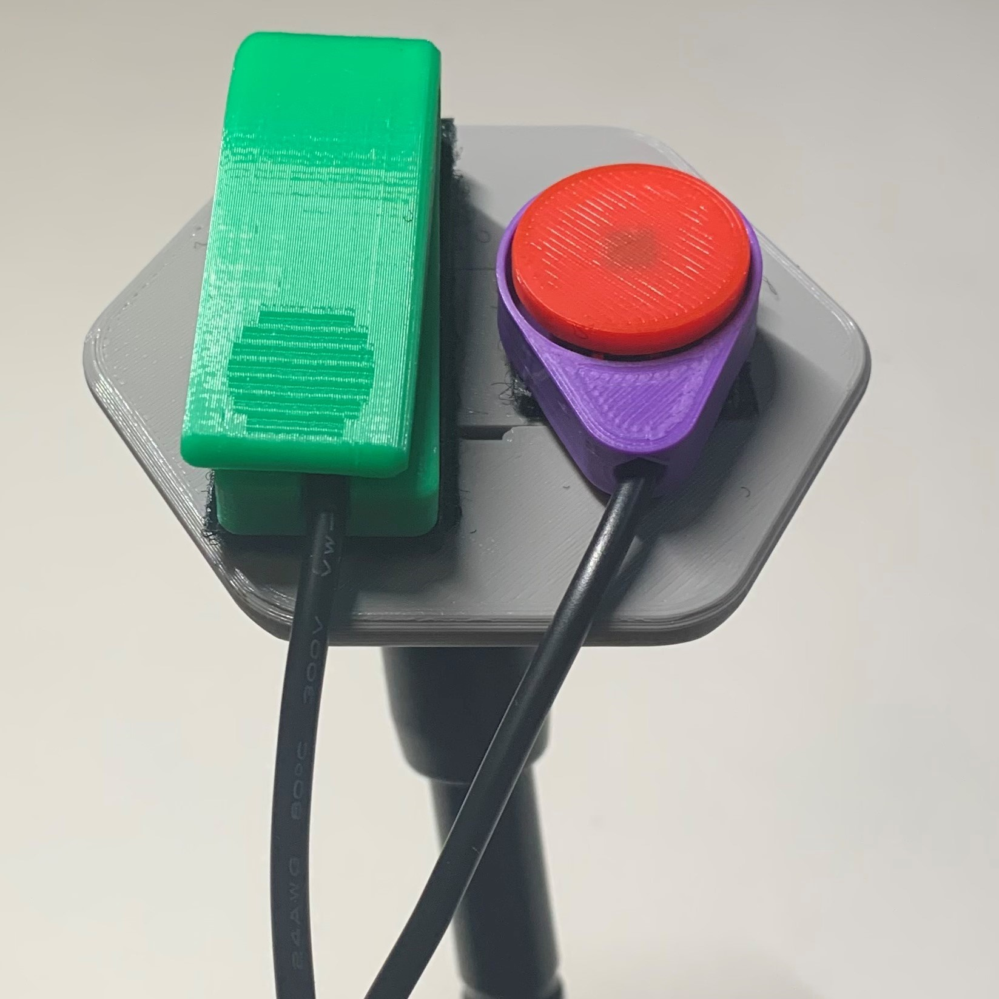

#  Open Universal Mounting Plate
The Open Universal Mounting Plate is a simple mounting option for assistive devices that do not have integrated mounting hardware. This device uses hook and loop fastener strips to attach to an assistive device allowing it to be mounted with standard ¼”-20 mounts, like those found on readily available camera mounting accessories.

## More info at
- [Makers Making Change Project Page](https://makersmakingchange.com/project/open-universal-mounting-plate)

## How to Obtain an Open Universal Mounting Plate
### 1. Do it Yourself (DIY) or Do it Together (DIT)

This is an open-source assistive technology, so anyone is free to build it. All of the files and instructions required to build the Open Universal Mounting Plate are contained within this repository. Refer to the Maker Checklist below.

### 2. Request a build of this device

If you would like to obtain an Open Universal Mounting Plate, you may submit a build request through the [MMC Library Page](https://makersmakingchange.com/project/open-universal-mounting-plate/). The requestor is responsible for the cost of materials and any shipping.

### 3. How to build this device for someone else

If you have the skills and equipment to build this device, and would like to donate your time to create the switch for someone who needs it, visit the [MMC Maker Wanted](https://makersmakingchange.com/maker-wanted/) section.

## Getting Started

### 1. Read the Makers Checklist

The Makers Checklist contains a list of tasks to complete to build the device.

### 2. Order the Off-The-Shelf Components

The [Bill of Materials](/Documentation/Open_Universal_Mounting_Plate_BOM.xlsx) lists all of the parts and components required to build the Open Universal Mounting Plate. The off-the-shelf components are are available online or may be available in smaller quantities at your local hardware store or dollar store.

### 3. Print the 3D Printable components

Refer to the [Sizing Chart](/Documentation/Open_Universal_Mounting_Plate_Sizing_Chart.pdf) to determine the correct configuration and corresponding print files.

All of the files and individual print files can be in the [/Build_Files/3D_Printing_Files](/Build_Files/3D_Printing_Files/) folder.

### 4. Assemble the Open Universal Mounting Plate...

Reference the [Assembly Guide](/Documentation/Open_Universal_Mounting_Plate_Assembly_Guide.pdf) for the tools and steps required to build each portion.

## Files
### Documentation
| Document             | Version | Link |
|----------------------|---------|------|
| Design Rationale     | 1.0     | [Open_Universal_Mounting_Plate_Design_Rationale](/Documentation/Open_Universal_Mounting_Plate_Design_Rationale.pdf)     |
| Maker Checklist      | 1.0     | [Open_Universal_Mounting_Plate_Maker_Checklist](/Documentation/Open_Universal_Mounting_Plate_Maker_Checklist.pdf)     |
| Bill of Materials    | 1.0     | [Open_Universal_Mounting_Plate_Bill_of_Materials](/Documentation/Open_Universal_Mounting_Plate_BOM.xlsx)     |
| 3D Printing Guide    | 1.0     | [Open_Universal_Mounting_Plate_3D_Printing_Guide](/Documentation/Open_Universal_Mounting_Plate_3D_Printing_Guide.pdf)     |
| Assembly Guide       | 1.0     | [Open_Universal_Mounting_Plate_Assembly_Guide](/Documentation/Open_Universal_Mounting_Plate_Assembly_Guide.pdf)     |
| User Guide           | 1.0     | [Open_Universal_Mounting_Plate_User_Guide](/Documentation/Open_Universal_Mounting_Plate_User_Guide.pdf)    |
| Sizing Chart         | 1.0     | [Open_Universal_Mounting_Plate_Sizing_Chart](/Documentation/Open_Universal_Mounting_Plate_Sizing_Chart.pdf)     |
| Changelog            | 1.0     | [Open_Universal_Mounting_Plate_Changelog](/Documentation/Open_Universal_Mounting_Plate_Changelog.pdf)     |

### Design Files
- [CAD Files](/Design_Files)

### Build Files
- [3D Printing Files](/Build_Files/3D_Printing_Files)

## Attribution

Design and documentation by Makers Making Change. 

## License
Everything needed or used to design, make, test, or prepare the Open Universal Mounting Plate is licensed under the CERN 2.0 Permissive license <https://ohwr.org/project/cernohl/wikis/Documents/CERN-OHL-version-2> (CERN-OHL-P) . 

Accompanying material such as instruction manuals, videos, and other copyrightable works that are useful but not necessary to design, make, test, or prepare the Open Universal Mounting Plate are published under a Creative Commons Attribution-ShareAlike 4.0 license https://creativecommons.org/licenses/by-sa/4.0/ (CC BY-SA 4.0).

---
<!-- ABOUT MMC START -->
## About Makers Making Change

Makers Making Change is an initiative of [Neil Squire](https://www.neilsquire.ca/), a Canadian non-profit that empowers people with disabilities.

We are committed to creating a network of volunteer makers who support people with disabilities in their communities through 3D printing assistive devices. Check out our library of free, open-source assistive technologies with parts and build instructions.

 - Website: [www.MakersMakingChange.com](https://www.makersmakingchange.com/)
 - GitHub: [https://github.com/makersmakingchange](https://github.com/makersmakingchange)
 - Twitter: [@makermakechange](https://twitter.com/makermakechange)
 - Instagram: [@makersmakingchange](https://www.instagram.com/makersmakingchange)

## Contact Us

For technical questions, to get involved, or share your experience we encourage you to visit the [MMC Website](https://www.makersmakingchange.com/), [MMC Forum](https://makersmakingchange.com/forum), or contact info@makersmakingchange.com
<!-- ABOUT MMC END -->
